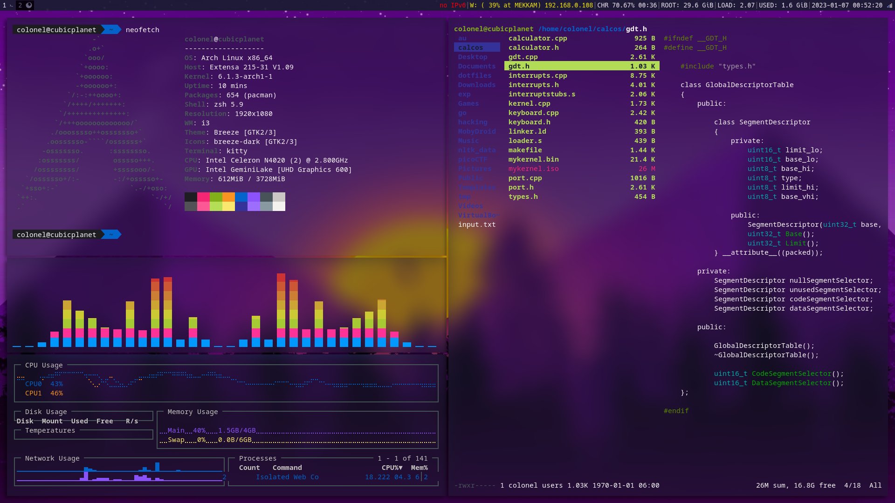
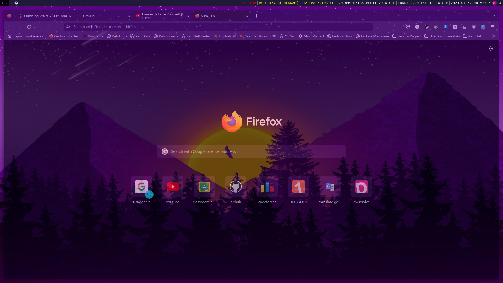

# dotfiles
  
 

 
 

**VM:** i3-gaps 
**Status Bar:** i3status 
**Compositor:** picom 
**Terminal** kitty 
**DMENU** rofi

 

**Terminal Apps**: gotop, cava, neofetch, ranger

 
 

**Inspired by:** https://www.reddit.com/r/unixporn/comments/c0i8e1
