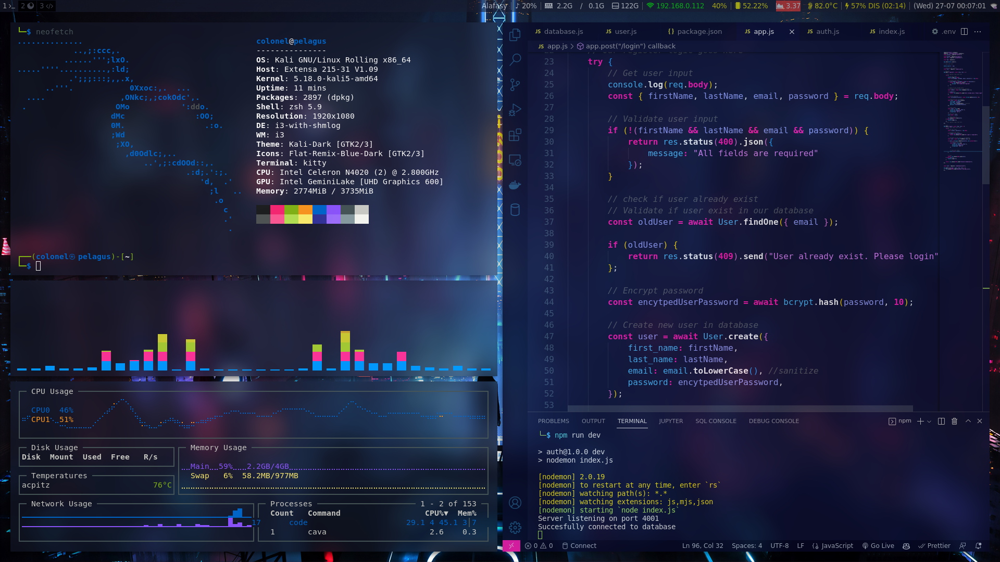
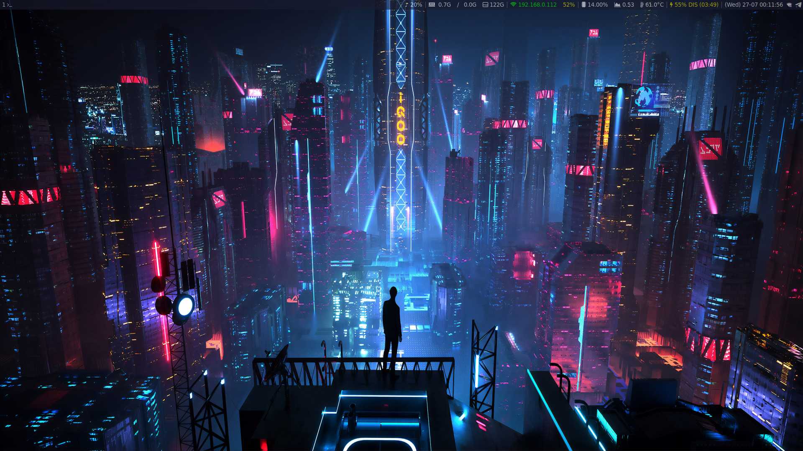

# dotfiles
  
 

 
 

**VM:** i3-gaps(4.19.1) 
**Status Bar:** i3blocks(1.4) 
**Compositor:** picom(9.1) 
**Terminal** kitty(0.21.2) 

 

**Terminal Apps**: gotop, cava, neofetch

 
 

**Inspired by:** https://www.reddit.com/r/unixporn/comments/c0i8e1
