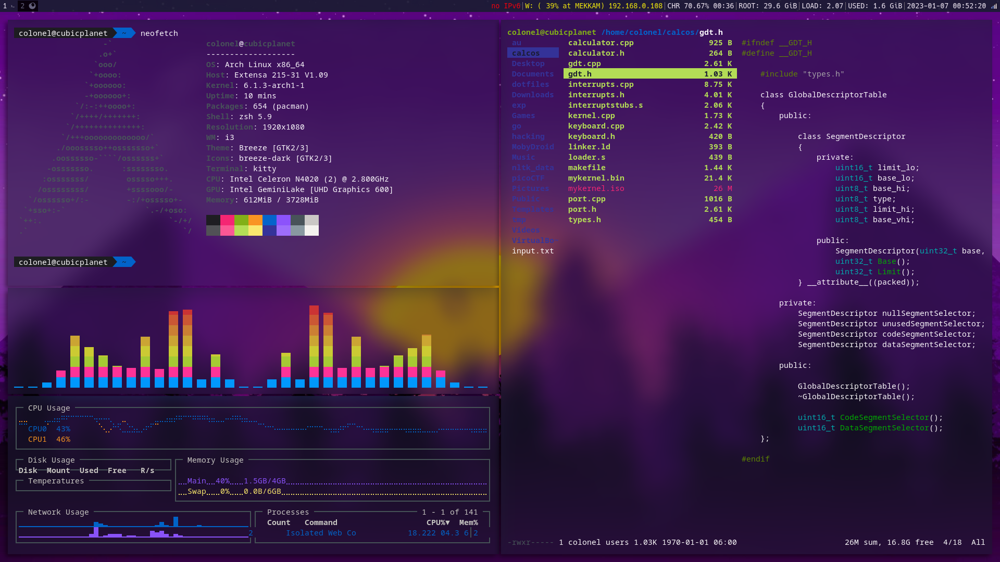
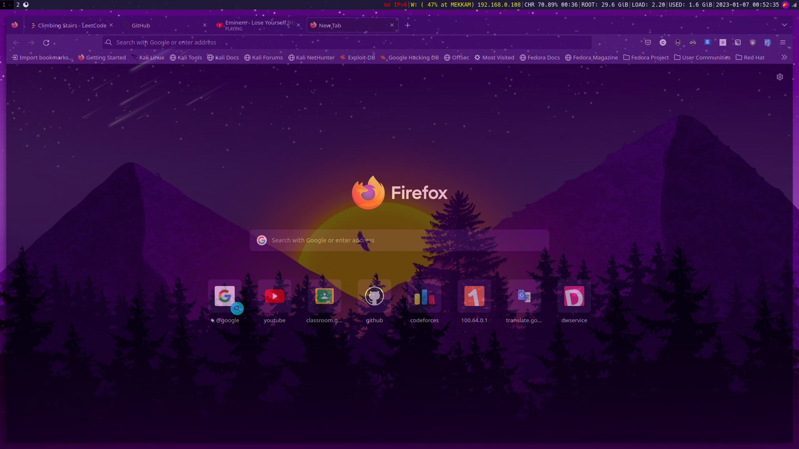
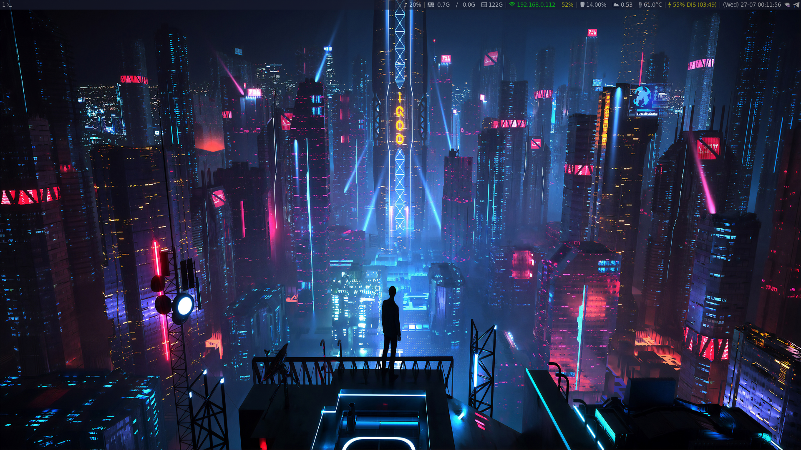
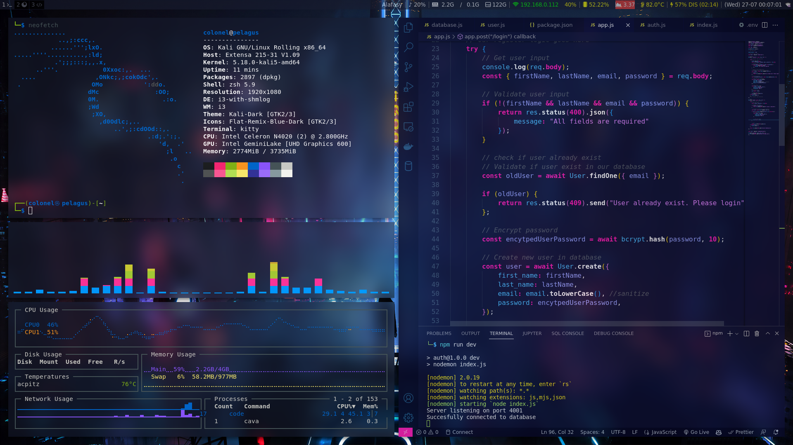

<div align="center">

# dotfiles

**A purple, gapped `i3` rice — built on Kali, finished on Arch.**


<br>

[](assets/screenshots/arch-1.png)

━━━━━━ ❖ ━━━━━━

</div>

## Contents

- [The rice](#the-rice)
- [Gallery](#gallery)
- [Keybindings](#keybindings)
- [Install](#install)
- [Structure](#structure)
- [Known rough edges](#known-rough-edges)
- [Credits](#credits)

━━━━━━ ❖ ━━━━━━

## The rice

| | |
|---|---|
| **Window manager** | [i3-gaps](https://github.com/Airblader/i3) — 10px outer, 5px inner, borderless |
| **Bar** | [i3status](https://i3wm.org/i3status/) |
| **Terminal** | [kitty](https://sw.kovidgoyal.net/kitty/) — Space Grotesk 13, 50% opacity |
| **Launcher** | [rofi](https://github.com/davatorium/rofi) — `drun` with icons |
| **Compositor** | [picom](https://github.com/yshui/picom) |
| **Shell** | [zsh](https://www.zsh.org/) + [oh-my-zsh](https://ohmyz.sh/), `agnoster` theme, autosuggestions + syntax-highlighting |
| **Editor** | [neovim](https://neovim.io/) — packer, catppuccin, lualine, telescope, mason LSP, nvim-tree |
| **Visualizer** | [cava](https://github.com/karlstav/cava) |
| **Screenshots** | [flameshot](https://flameshot.org/) |
| **Lockscreen** | [i3lock](https://i3wm.org/i3lock/) via `xss-lock` |
| **GRUB theme** | CyberPunk |
| **Fonts** | Space Grotesk, Hack, Font Awesome 6 |

### Palette

The window manager and terminal share one background; the terminal's ANSI colors are Monokai-flavoured, and neovim runs catppuccin on top.

| | Hex | Used for |
|---|---|---|
| ⬛ | `#181c30` | Background — i3 bar, kitty |
| ⬜ | `#f3f4f5` | Foreground text |
| 🟪 | `#676e7d` | Inactive workspaces |
| 🟥 | `#e53935` | Urgent workspaces |
| 🌸 | `#f92672` | ANSI red |
| 🟩 | `#b6e354` | ANSI green |
| 🟨 | `#feed6c` | ANSI yellow |
| 🔮 | `#9e6ffe` | ANSI magenta |

━━━━━━ ❖ ━━━━━━

## Gallery

### Arch — current

`i3status` bar, neofetch, cava, gotop and ranger across two columns.

[](assets/screenshots/arch-1.png)

[](assets/screenshots/arch-2.png)

<details>
<summary><b>Kali — previous rice</b> (icon bar + cyberpunk wallpaper)</summary>

<br>

Same configs, earlier era: the bar ran `i3blocks` with icon blocklets, and the wallpaper was `argumented-city.jpg`.

[](assets/screenshots/kali-1.png)

[](assets/screenshots/kali-2.png)

</details>

━━━━━━ ❖ ━━━━━━

## Keybindings

`$mod` is **Alt** (`Mod1`), not Super.

### Launching

| Keys | Action |
|---|---|
| <kbd>Alt</kbd> + <kbd>Return</kbd> | Terminal (kitty) |
| <kbd>Alt</kbd> + <kbd>d</kbd> | App launcher (rofi) |
| <kbd>Alt</kbd> + <kbd>Shift</kbd> + <kbd>q</kbd> | Close window |
| <kbd>Print</kbd> | Screenshot, full screen |
| <kbd>Shift</kbd> + <kbd>Print</kbd> | Screenshot, select region |

### Focus and movement

Note the focus row is i3's **default** `j k l ;` layout, not the vim-style `h j k l` — <kbd>j</kbd> is left and <kbd>k</kbd> is down.

| Keys | Action |
|---|---|
| <kbd>Alt</kbd> + <kbd>j</kbd> / <kbd>k</kbd> / <kbd>l</kbd> / <kbd>;</kbd> | Focus left / down / up / right |
| <kbd>Alt</kbd> + <kbd>Shift</kbd> + <kbd>j</kbd> / <kbd>k</kbd> / <kbd>l</kbd> / <kbd>;</kbd> | Move window left / down / up / right |
| <kbd>Alt</kbd> + arrow keys | Focus, same as above |
| <kbd>Alt</kbd> + <kbd>Shift</kbd> + arrows | Move window, same as above |
| <kbd>Alt</kbd> + <kbd>a</kbd> | Focus parent container |
| <kbd>Alt</kbd> + <kbd>1</kbd> … <kbd>0</kbd> | Switch to workspace 1–10 |
| <kbd>Alt</kbd> + <kbd>Shift</kbd> + <kbd>1</kbd> … <kbd>0</kbd> | Send window to workspace 1–10 |

### Layout

| Keys | Action |
|---|---|
| <kbd>Alt</kbd> + <kbd>h</kbd> / <kbd>v</kbd> | Split horizontal / vertical |
| <kbd>Alt</kbd> + <kbd>f</kbd> | Fullscreen |
| <kbd>Alt</kbd> + <kbd>s</kbd> / <kbd>w</kbd> / <kbd>e</kbd> | Stacking / tabbed / toggle split |
| <kbd>Alt</kbd> + <kbd>Shift</kbd> + <kbd>space</kbd> | Toggle floating |
| <kbd>Alt</kbd> + <kbd>space</kbd> | Focus between tiling and floating |
| <kbd>Alt</kbd> + <kbd>r</kbd> | Resize mode — `j k l ;` or arrows, <kbd>Esc</kbd> to exit |

### Session

| Keys | Action |
|---|---|
| <kbd>Alt</kbd> + <kbd>Shift</kbd> + <kbd>c</kbd> | Reload config |
| <kbd>Alt</kbd> + <kbd>Shift</kbd> + <kbd>r</kbd> | Restart i3 in place |
| <kbd>Alt</kbd> + <kbd>Shift</kbd> + <kbd>e</kbd> | Exit i3 |
| <kbd>Win</kbd> + <kbd>space</kbd> | Toggle keyboard layout (US / RU) |

Media and brightness keys (`XF86Audio*`, `XF86MonBrightness*`) are bound to `amixer` and `light`.

━━━━━━ ❖ ━━━━━━

## Install

> [!WARNING]
> The installer symlinks over your existing configs and installs packages with `sudo`. Read it before running it. Anything it replaces is moved to `~/.dotfiles-backup/<timestamp>/` first.

```bash
curl -O https://raw.githubusercontent.com/karrvel/dotfiles/main/installer.sh
chmod +x installer.sh
./installer.sh
```

It detects `pacman` / `apt-get` / `yum`, installs the packages, sets up oh-my-zsh with its two plugins, clones this repo to `~/dotfiles`, symlinks every config into `~/.config`, and refreshes the font cache.

### Manual

```bash
git clone https://github.com/karrvel/dotfiles ~/dotfiles

ln -sfn ~/dotfiles/i3       ~/.config/i3
ln -sfn ~/dotfiles/i3status ~/.config/i3status
ln -sfn ~/dotfiles/kitty    ~/.config/kitty
ln -sfn ~/dotfiles/picom    ~/.config/picom
ln -sfn ~/dotfiles/cava     ~/.config/cava
ln -sfn ~/dotfiles/nvim     ~/.config/nvim

ln -sfn ~/dotfiles/assets/wallpapers ~/.config/wallpapers
ln -sfn ~/dotfiles/assets/fonts      ~/.local/share/fonts
ln -sfn ~/dotfiles/zsh/.zshrc        ~/.zshrc

fc-cache -f
```

### After installing

- **Wallpaper** — set in `i3/config`, on the `feh --bg-scale` line. Options live in `assets/wallpapers/`.
- **Weather blocklet** — `i3blocks/scripts/weather.sh` reads `$OPENWEATHER_API_KEY`; export it from your shell.
- **`~/.zshctf`** — `.zshrc` sources this unconditionally. The installer creates it; keep local secrets there, it is gitignored.
- **`$PATH`** — `.zshrc` hardcodes Flutter, Android Studio and `java-17` paths. Prune them if you don't use them.

━━━━━━ ❖ ━━━━━━

## Structure

```
.
├── assets/
│   ├── fonts/          Space Grotesk, Hack, Font Awesome 6, + others → ~/.local/share/fonts
│   ├── grub-themes/    CyberPunk
│   ├── screenshots/    the images in this README
│   └── wallpapers/
├── cava/               audio visualizer
├── i3/                 window manager — keybinds, colors, autostart
├── i3blocks/           bar config + vendored blocklets (see note below)
├── i3status/           the bar actually in use
├── kitty/              terminal
├── nvim/               neovim, packer-managed, config under lua/simp1e/
├── picom/              compositor
├── vim/                plain .vimrc
├── zsh/                .zshrc — oh-my-zsh, agnoster
└── installer.sh
```

━━━━━━ ❖ ━━━━━━

## Known rough edges

Kept honest rather than tidied away:

- **`i3blocks/` is not wired up.** The bar runs `i3status`. `i3blocks/config` also points every block at the distro's `/usr/share/i3blocks/` blocklets, so the scripts in `i3blocks/scripts/` are unreferenced too. See [`i3blocks/scripts/CREDITS.md`](i3blocks/scripts/CREDITS.md).
- **conky is launched but not configured here.** `i3/config` execs `~/.config/conky/{status,time}`; those files are not in this repo. Remove the two `exec` lines or supply your own.
- **gotop, neofetch and ranger** show up in the screenshots but ship no config here and are not installed by `installer.sh`.
- **`i3/config` has a hardcoded touchpad device name** for `xinput`, which will not match your hardware.

━━━━━━ ❖ ━━━━━━

## Credits

- Blocklet scripts vendored from [icemodding/i3](https://github.com/icemodding/i3/tree/master/scripts).
- neovim config grown from the [LunarVim/Neovim-from-scratch](https://github.com/LunarVim/Neovim-from-scratch) layout.

### Licensing

The config files here are mine — take them, fork them, rice them. The bundled assets are **not**: each font keeps its own `OFL.txt`, Font Awesome ships under its own terms, and the GRUB theme and wallpapers belong to their respective authors. Check those before redistributing.

<div align="center">

━━━━━━ ❖ ━━━━━━

*Happy ricing)*

</div>
